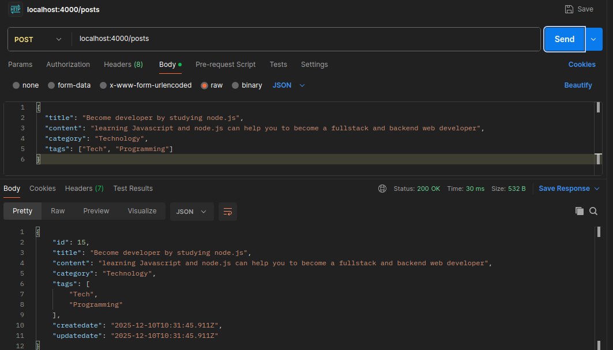
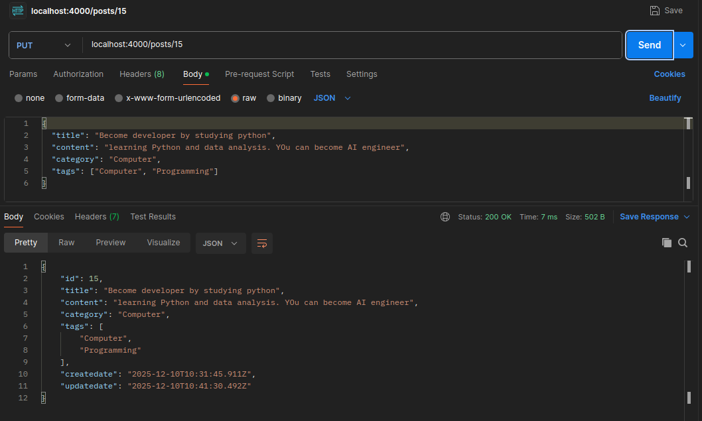
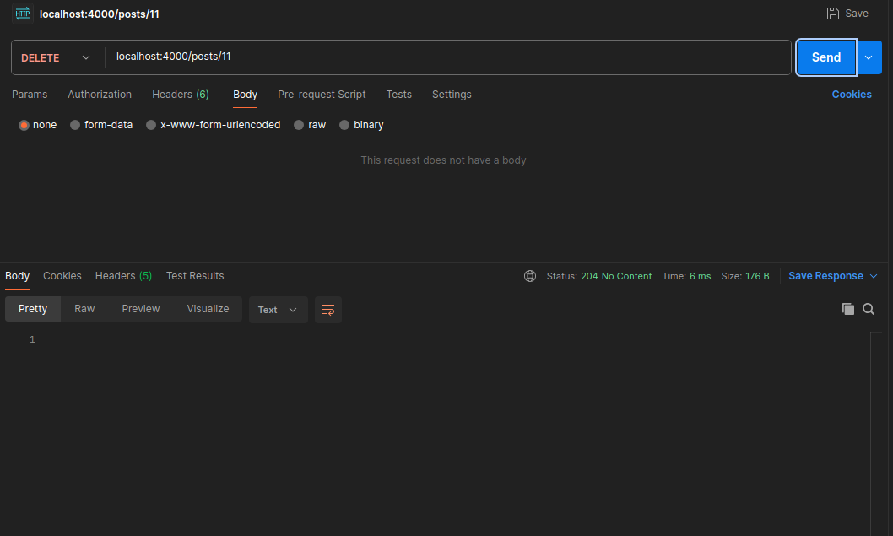
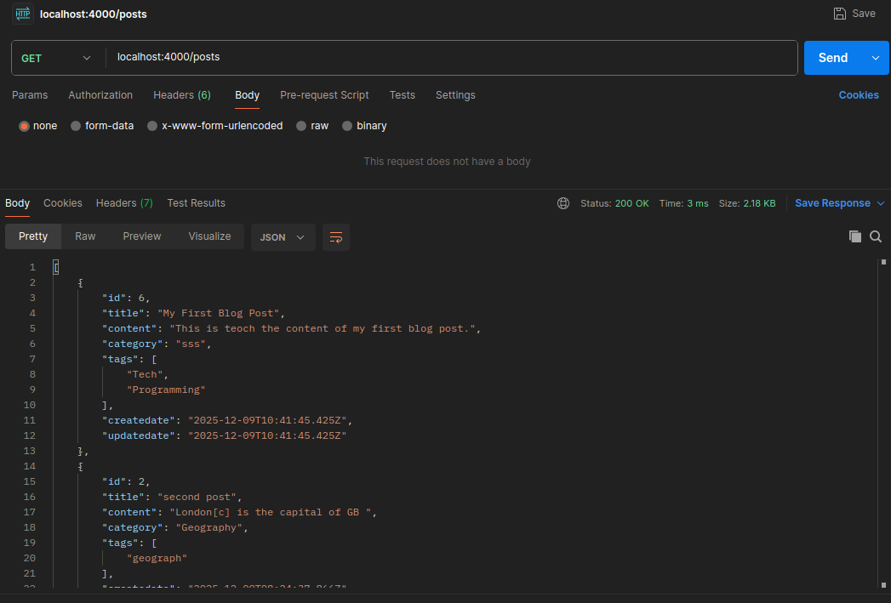
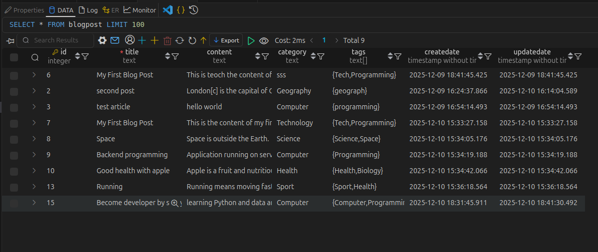

This project implement the RESTful api of blogging platform for the requirement of roadmap.sh backend project (https://roadmap.sh/projects/blogging-platform-api).

This project use **node.js + express** as backend and **PostgreSQL** as database.

To run the project, please install **node.js** and **PostgreSQL**.

1. download the respository and unzip
2. modified the environmnet variable stored in `.env` file according to your database setting.
3. use the command in `creatTable.sql` file to create a table in PostgreSQL to store the articles
4. open terminal and go to project folder, type command `npm install` to install all neccessary npm modules
5. type `node index.js` to run the server.

The port opened is 4000. The path should be http://localhost:4000/XXXX

The API is tested with **Postman**

**Creating a new post**
method `POST`  + path `/posts`
server return the all property of post stored in database

**Update post**
method `PUT` + path `/posts/id`
server return the updated post stored in database

**Get a post**
method `GET` + path `/posts/id`
server return the post with specified id

**Delete a post**
method `Delete` + path `/posts/id`
server return the post with specified id

**Get all posts**
method `GET` + path `/posts`
server return all posts stored in the database

The posts stored in the table

**Search posts contains key word**
method `GET` + path `/posts` + query `?term=health'
server return posts contain the key word
